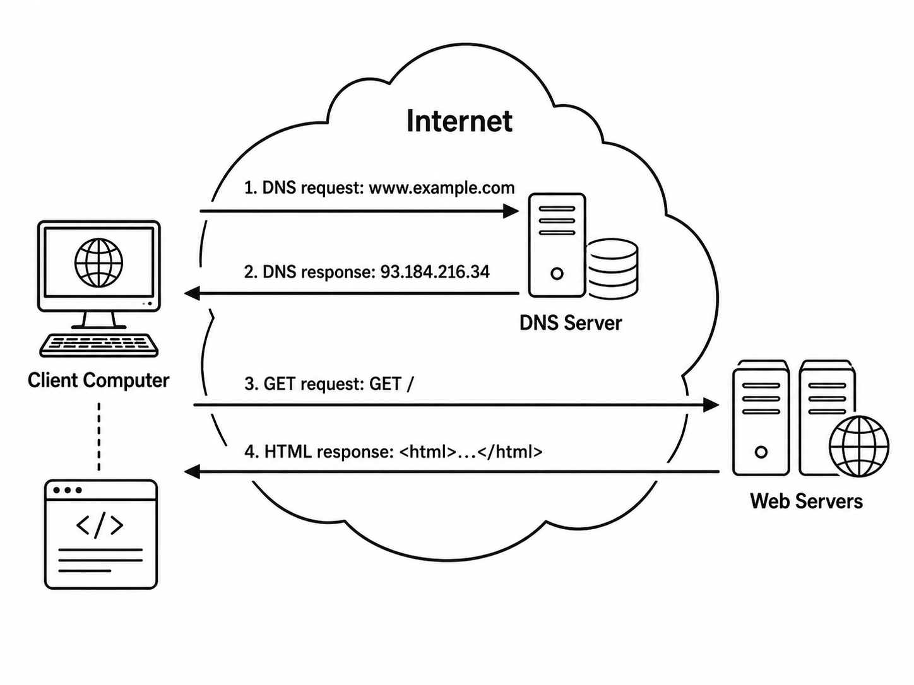

# How the Internet Works #

The purpose of this lesson is to teach students how the internet works at a popular level but with some technical detail. It covers how data is divided into small chunks called packets, how packets use addresses to reach their destination, and how human-readable domain names are translated into IP addresses that computers can use for communication.

My goal is for this lesson to take no more than 50 minutes. This allows the remaining class period time to focus on readings and discussion of the larger class themes. It would be easy for the activities and discussions to get away, so keep a sharp watch on the time.

## Part 1: Packets and Addresses (20 min) ##

This will be an object lesson using postcards that I mailed to myself while on vacation. It will involve several features of data communication, including that large messages can be split across multiple postcards (packets) and that each packet needs an address to be delivered properly. It will ignore things like a sequential numbering system and the route that each packet must travel or the fact that individual postcards might traverse different paths. Students might bring these things up, which would be fine, but they are topics that will be covered in future lessons.

### Introduce Postcards ###

Break the students up into groups of three or four students. Hand each group a set of *four* postcards that contain a letter, with each postcard holding one or two sentences. Each group can receive the same message or there can be a different version for each group. The letter should be written such that it's not completely clear what order the cards should be placed in. Four postcards is ideal because it would be easy to put them all onto a single slide that is displayed for all the students to see at once.

**Note:** The order of the postcard sentences is purposely ambiguous. However, try to avoid fully resolving the ordering problem in this lesson; students will return to the packet-ordering issue in a future lesson.

### Postcard Contents ###

The postcards should have messages that are something like this:

#### Group #1 #### 

1. Dear Dog, I hope that you are enjoying your time at home.
2. We are having fun on the vacation but certainly miss you.
3. Today we saw a herd of bison and a large bear, but no moose.
4. You are better off at home with Grandma and Grandpa because Dad is doing the cooking. Love, your family.

#### Group #2 ####

1. Dear Dog, How are you getting along at home?
2. The driving days are very long and we sometimes get into arguments.
3. Dad is getting a little stinky and can be cranky at times.
4. I hope that you are going on nice walks. Love, your family.

#### Group #3 ####

1. Dear Dog, We have reached the family reunion.
2. You would like it here a lot, especially cousin Sally.
3. Dad's family is surprisingly normal considering how strange he is.
4. Pass on our love to Grandma and Grandpa. Love, your family.

### Instructions to Students ### 

Explain that my family wanted to send messages to our dog while out on vacation, but it was too long to be written on a single postcard (or piece of paper). Show them the sets of postcards and let the students reconstruct the original messages from the individual postcards. Along the way, they should take notes about my family's message system. For example, they should observe things like:

* The need to address the postcards and what information is included in the address.
* How a long message can be divided into smaller chunks.
* What limited the length of each message.
* More efficient / more logical ways to divide the message.
* Any difficulties that arose when completing the task.

Students should agree on answers and take notes.  This shouldn't take more than five or ten minutes.

### Discussion ###

Discuss the results as a whole class. Ask one of the groups to summarize their experience. Ask the other groups to correct errors and fill in any missing information. Was this an easy task? What parts, if any, were difficult? There are a few details that should be covered during the discussion.

It's fairly easy to divide a long message into small parts. This is especially true when there's a common greeting to begin a message and also to end it. It's standard practice to begin a letter with "Dear..." and to finish with a salutation like "Sincerely," or "Love," and so on. Some details worth pointing out:

* Large messages can be divided into smaller pieces. On the internet, these pieces are called packets.
* Each packet needs addressing information so the network knows where to send it.
* There are different parts of an address, each one having a different level of detail. The state and city are at the highest level, then the street and house number. The first and last name are the most granular pieces of information.
* Communication systems often have size limits. A postcard has limited writing space; network packets also have maximum sizes.
* Humans can often infer missing order or context, but computers need explicit rules and extra information.
* It's possible that one of the postcards might be lost along the way or they could arrive on different days.
* Everyone in the postal system can read the contents of the postcards.
* Mail usually includes a destination address and a source address, so the receiver knows where the packet came from and where replies should go. Internet packets are similar.

In this analogy, each postcard was like a small piece of data sent on the internet, called a packet. A packet is a small piece of data with delivery information attached. Packets are part of larger messages sent between computers. The recipient is responsible for putting the individual data packets back together to form the original message.

### Transition to Next Topic ###

Think about how the addressing for the postcard worked. We cared most about the person who was supposed to receive the message, but the person's name alone was not enough for the post office to deliver the postcard. The postal system does not automatically know where every person lives, and even if it did, people move. A previous address may no longer be valid.

For a postcard or letter to be delivered, it needs both a recipient’s name and a mailing address. Digital communication has a similar problem. We may know that we want to access a website such as `www.wikipedia.org`, but the computer still needs an address it can use to find the server where that website is hosted. That machine-usable address is called an IP address.

## Part 2: Domain Name System (20 min) ##

The following activity is based on [Code.org's DNS Unplugged Activity](https://studio.code.org/courses/csp-2025/units/2/lessons/6#activity-section-51808796), which is licensed under [CC BY-NC-SA 4.0](http://creativecommons.org/licenses/by-nc-sa/4.0/). The section below has been adapted from Code.org and updated slightly to fit this course. This use is educational and noncommercial; it does not imply endorsement by Code.org.

### The Need for DNS ###

This quick unplugged activity helps students understand why the DNS exists in the first place. It can be done very quickly, typically in about 5 minutes, before students start to see the core challenge. If students start running away from you that's a good sign they've seen what makes this activity tricky. Keep the exercise going long enough for the students to become frustrated with all of the changing IP addresses.

#### Starting the Exercise ####

When you walked into the room I handed each of you a slip of paper. This is your IP address. We know that in order to communicate on the internet you need to know the IP address of the other computer. Your goal is to create and maintain a list of every one of your classmates' IP addresses. If your classmates represent computers on the internet, this list of IP addresses would allow you to communicate with each one of them.

The only rules:

* You may walk around the room
* You may share information with classmates
* You may talk / share information with only ONE classmate at a time

#### During the Exercise ####

As students are working, circulate quietly through the room. Approach a student and silently take their IP address slip away from them.
Give that person a new IP address slip (or a re-used IP address). Repeat the above two steps as many times as you can, as you circulate the room.

#### After the Exercise ####

Ask the students to form small groups and discuss with their classmates the following prompts:

* Why do you think I was switching your IP addresses?
* What made the exercise difficult: the number of classmates, the changing IP addresses, or the fact that information spread person-to-person? Why?
* If this activity had 30 students, it would be annoying. If it had 30 million devices, what new problems would appear?
* What could go wrong if someone gave you the wrong IP address for a website?
* If IP addresses can change, is there a better way for everyone to know everyone else's IP address?

Bring the class back together as one large group to discuss the answers to these questions. Explain that there is a standard system for computers to request the IP address that belongs to a given domain name. This system is called the Domain Name System, or DNS.

* Devices are joining and leaving the Internet all the time. IP addresses do not always stay constant. If you go to a coffee shop or restart your router, your device might be assigned a new IP address. IP addresses can change for servers too.
* If IP addresses can change, it is very hard for every computer to maintain its own accurate list of names and addresses.
* The Internet needs shared infrastructure that helps computers find one another at a massive scale. DNS provides this by translating human-readable domain names into machine-usable IP addresses.
* DNS is useful because people are better at remembering names like `example.com` than numbers like `93.184.216.34`.
* DNS also introduces trust. When your computer asks for the IP address of a website, it is relying on the DNS system to give a correct answer.
* If someone gives you the wrong IP address for a website, you could be sent to the wrong server. That could cause confusion, failed communication, or security problems.
* Control over names is powerful. Domain names can shape who is easy to find, who is hard to find, and who gets to decide where a name points.
* DNS is technical infrastructure, but it has social consequences. It affects communication, commerce, education, security, and even politics.

After establishing some basic facts about DNS, transition the discussion to larger security issues.

DNS relies upon a set of trusted internet servers that keep track of the necessary domain name and IP address information. It is a distributed system with many different servers managed by different organizations. No one computer has all of the information at any time and the DNS servers often have to update their information by communicating with each other and then storing the result for a short period of time. All of the computers follow a set of common rules for answering these name-resolution requests.

Your home computer probably uses a DNS server that is maintained by your internet service provider. When you are on campus using wifi, the university itself is your internet provider, so your computer is querying the university's DNS server. It's possible for users to configure a specific DNS resolver instead of relying on the default server provided by their internet provider.

Some additional questions for the class might include:

* Domain names can be sold, seized, blocked, or redirected. Why does control over naming become a form of power?
* DNS is technical infrastructure, but it affects communication, commerce, education, and politics. Who should be trusted to operate or regulate systems like this?

***This concludes the material adapted from Code.org.***

## Conclusion (10 min) ##

Show a diagram of internet traffic including a DNS request/response and an HTTP request/response. Ask the students to walk through the steps one at a time:

1. The user types a human-readable domain name.
2. The computer uses DNS to find the corresponding IP address.
3. The computer sends a request to that IP address.
4. The server sends a response back.
5. The browser uses the response to display the webpage.

Emphasize that DNS does not send the webpage. DNS only helps the computer find the address. The HTTP request is the separate step where the browser asks the web server for the page.

For example, consider this simple diagram that was generated by ChatGPT:

